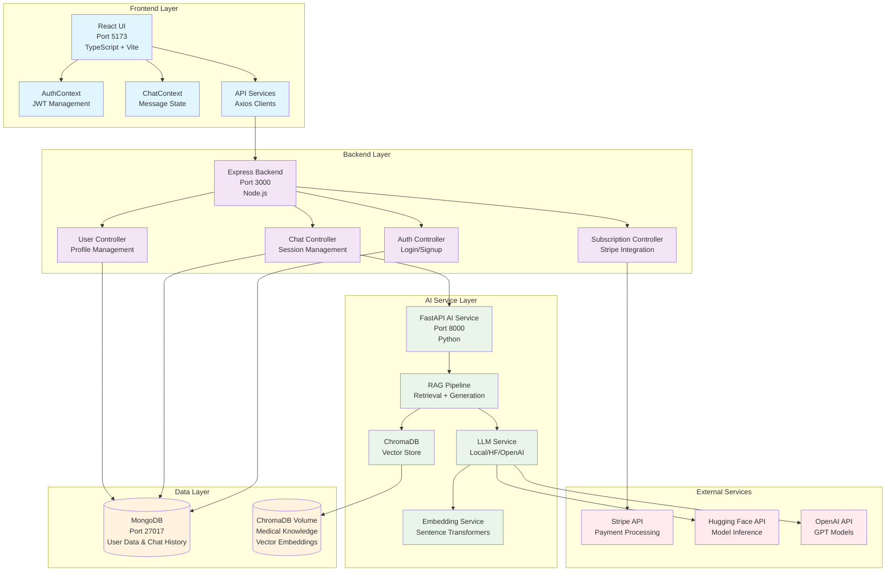
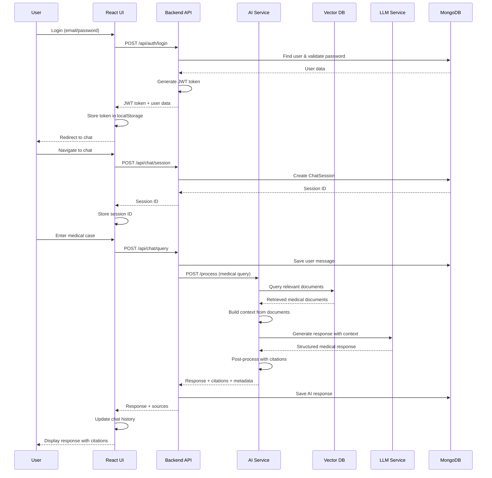
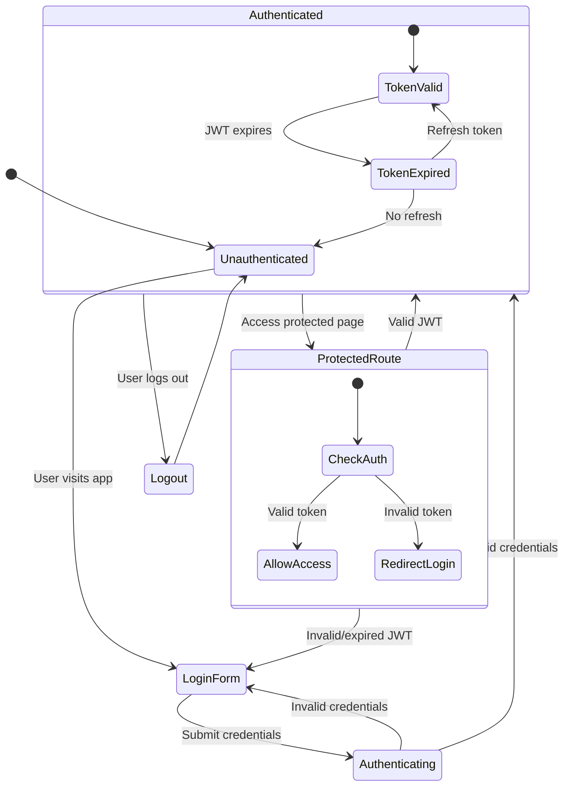
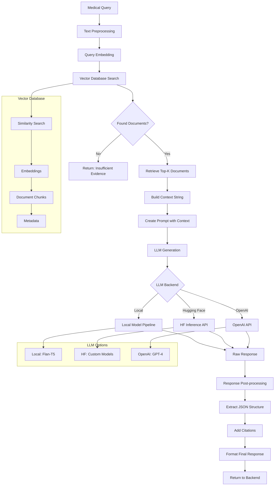
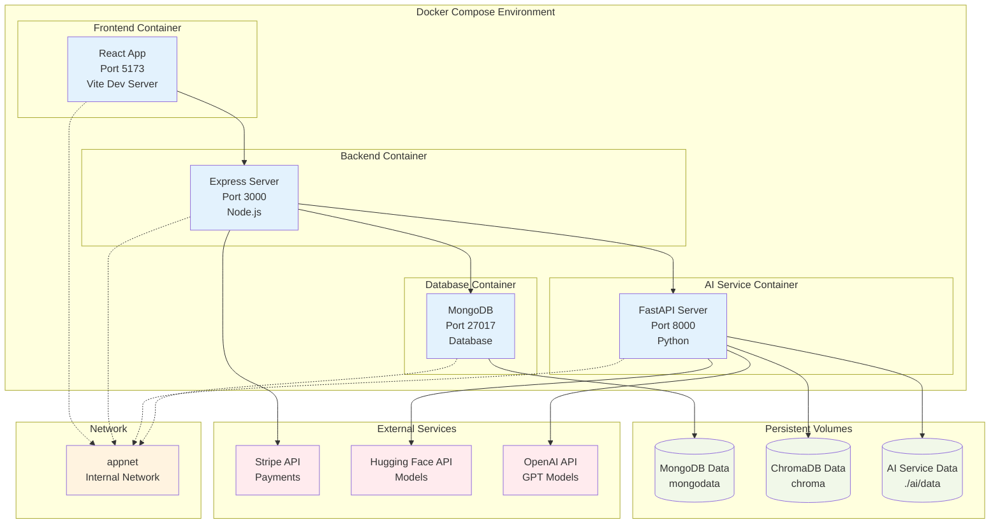
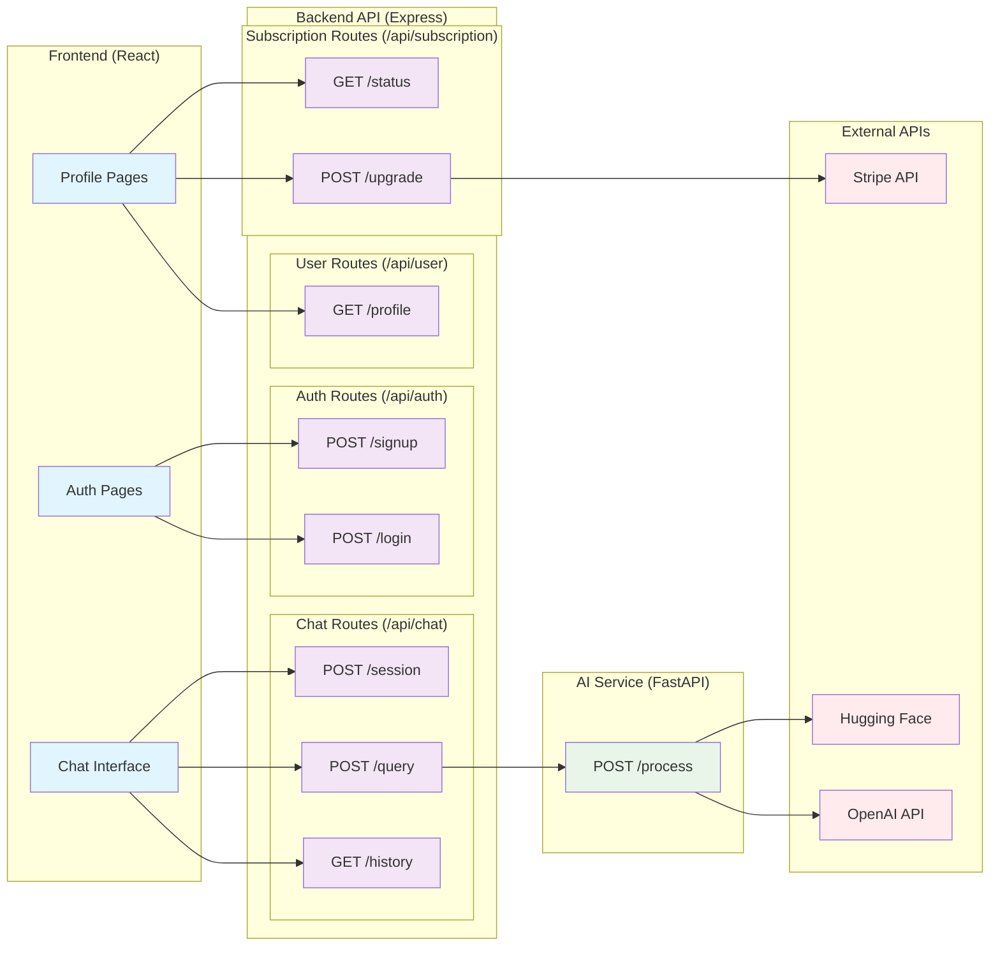
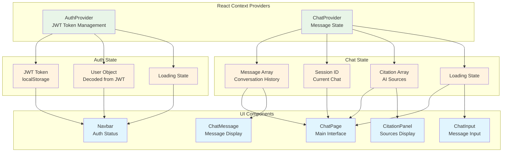
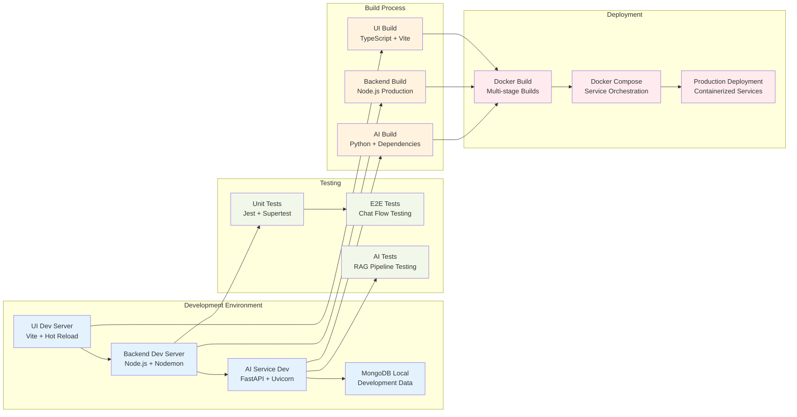

# Clinical AI System - Architecture Diagrams

## 🏗️ System Architecture Overview



## 🔄 Detailed Data Flow



## 🗂️ File Structure & Dependencies

```mermaid
graph TD
    subgraph "Root Level"
        DOCKER[docker-compose.yaml<br/>Service Orchestration]
    end

    subgraph "Frontend (/ui/)"
        UI_PKG[package.json<br/>Dependencies]
        UI_MAIN[main.tsx<br/>Entry Point]
        UI_APP[App.tsx<br/>Routing]
        UI_AUTH_CTX[AuthContext.tsx<br/>JWT Management]
        UI_CHAT_CTX[ChatContext.tsx<br/>Message State]
        
        subgraph "UI Services"
            UI_API[api.ts<br/>Axios Config]
            UI_AUTH_SVC[authService.ts<br/>Auth API]
            UI_CHAT_SVC[chatService.ts<br/>Chat API]
        end
        
        subgraph "UI Pages"
            UI_CHAT_PAGE[ChatPage.tsx<br/>Main Interface]
        end
        
        subgraph "UI Components"
            UI_CHAT_INPUT[ChatInput.tsx<br/>Message Input]
            UI_CHAT_MSG[ChatMessage.tsx<br/>Message Display]
            UI_CITATION[CitationPanel.tsx<br/>Sources Display]
        end
        
        UI_CONFIG[vite.config.ts<br/>Build Config]
    end

    subgraph "Backend (/backend/)"
        BE_PKG[package.json<br/>Dependencies]
        BE_SERVER[server.js<br/>HTTP Server]
        BE_APP[app.js<br/>Express App]
        
        subgraph "Backend Config"
            BE_DB[config/db.js<br/>MongoDB Connection]
        end
        
        subgraph "Backend Models"
            BE_USER[models/User.js<br/>User Schema]
            BE_SESSION[models/ChatSession.js<br/>Session Schema]
            BE_MSG[models/Message.js<br/>Message Schema]
        end
        
        subgraph "Backend Controllers"
            BE_AUTH_CTRL[controllers/authController.js<br/>Auth Logic]
            BE_CHAT_CTRL[controllers/chatController.js<br/>Chat Logic]
            BE_SUB_CTRL[controllers/subscriptionController.js<br/>Subscription Logic]
        end
        
        subgraph "Backend Middleware"
            BE_AUTH_MID[middleware/authMiddleware.js<br/>JWT Validation]
        end
        
        subgraph "Backend Routes"
            BE_AUTH_ROUTE[routes/auth.js<br/>Auth Endpoints]
            BE_CHAT_ROUTE[routes/chat.js<br/>Chat Endpoints]
            BE_USER_ROUTE[routes/user.js<br/>User Endpoints]
            BE_SUB_ROUTE[routes/subscription.js<br/>Subscription Endpoints]
        end
        
        subgraph "Backend Services"
            BE_AI_CLIENT[services/aiClient.js<br/>AI Service Client]
        end
        
        BE_DOCKER[dockerfile<br/>Container Config]
        BE_TEST[__tests__/chat.e2e.test.js<br/>E2E Tests]
        BE_API_DOC[openapi-summary.yaml<br/>API Documentation]
    end

    subgraph "AI Service (/ai/)"
        AI_DOCKER[Dockerfile<br/>Container Config]
        AI_REQ[requirements.txt<br/>Python Dependencies]
        AI_APP[app.py<br/>FastAPI App]
        
        subgraph "AI API"
            AI_PROCESS[api/process.py<br/>Main Endpoint]
        end
        
        subgraph "AI RAG"
            AI_RAG[rag/rag_pipeline.py<br/>RAG Implementation]
            AI_PROMPT[rag/prompt_templates.py<br/>Prompt Engineering]
        end
        
        subgraph "AI Vector Store"
            AI_CHROMA[vectorstore/chroma_store.py<br/>Vector DB Operations]
        end
        
        subgraph "AI LLM"
            AI_LLM[llm/medical_llm.py<br/>Language Model Integration]
        end
        
        subgraph "AI Embeddings"
            AI_EMBED[embeddings/embedder.py<br/>Text Embeddings]
        end
        
        subgraph "AI Utils"
            AI_LOGGER[utils/logger.py<br/>Logging]
            AI_PREPROC[utils/preprocess.py<br/>Document Ingestion]
        end
        
        AI_TEST[tests/test_rag.py<br/>RAG Tests]
    end

    %% Dependencies
    DOCKER --> UI_PKG
    DOCKER --> BE_PKG
    DOCKER --> AI_REQ
    
    UI_MAIN --> UI_APP
    UI_APP --> UI_AUTH_CTX
    UI_APP --> UI_CHAT_CTX
    UI_APP --> UI_CHAT_PAGE
    UI_CHAT_PAGE --> UI_CHAT_INPUT
    UI_CHAT_PAGE --> UI_CHAT_MSG
    UI_CHAT_PAGE --> UI_CITATION
    UI_CHAT_PAGE --> UI_CHAT_SVC
    UI_CHAT_SVC --> UI_API
    UI_AUTH_CTX --> UI_AUTH_SVC
    UI_AUTH_SVC --> UI_API
    
    BE_SERVER --> BE_APP
    BE_APP --> BE_DB
    BE_APP --> BE_AUTH_ROUTE
    BE_APP --> BE_CHAT_ROUTE
    BE_APP --> BE_USER_ROUTE
    BE_APP --> BE_SUB_ROUTE
    BE_AUTH_ROUTE --> BE_AUTH_CTRL
    BE_CHAT_ROUTE --> BE_CHAT_CTRL
    BE_SUB_ROUTE --> BE_SUB_CTRL
    BE_CHAT_CTRL --> BE_AI_CLIENT
    BE_AUTH_ROUTE --> BE_AUTH_MID
    BE_CHAT_ROUTE --> BE_AUTH_MID
    BE_USER_ROUTE --> BE_AUTH_MID
    BE_SUB_ROUTE --> BE_AUTH_MID
    BE_AUTH_CTRL --> BE_USER
    BE_CHAT_CTRL --> BE_SESSION
    BE_CHAT_CTRL --> BE_MSG
    
    AI_APP --> AI_PROCESS
    AI_PROCESS --> AI_RAG
    AI_RAG --> AI_CHROMA
    AI_RAG --> AI_LLM
    AI_RAG --> AI_PROMPT
    AI_LLM --> AI_EMBED
    AI_PREPROC --> AI_CHROMA
    AI_PREPROC --> AI_EMBED

    classDef root fill:#ffecb3
    classDef frontend fill:#e1f5fe
    classDef backend fill:#f3e5f5
    classDef ai fill:#e8f5e8

    class DOCKER root
    class UI_PKG,UI_MAIN,UI_APP,UI_AUTH_CTX,UI_CHAT_CTX,UI_API,UI_AUTH_SVC,UI_CHAT_SVC,UI_CHAT_PAGE,UI_CHAT_INPUT,UI_CHAT_MSG,UI_CITATION,UI_CONFIG frontend
    class BE_PKG,BE_SERVER,BE_APP,BE_DB,BE_USER,BE_SESSION,BE_MSG,BE_AUTH_CTRL,BE_CHAT_CTRL,BE_SUB_CTRL,BE_AUTH_MID,BE_AUTH_ROUTE,BE_CHAT_ROUTE,BE_USER_ROUTE,BE_SUB_ROUTE,BE_AI_CLIENT,BE_DOCKER,BE_TEST,BE_API_DOC backend
    class AI_DOCKER,AI_REQ,AI_APP,AI_PROCESS,AI_RAG,AI_PROMPT,AI_CHROMA,AI_LLM,AI_EMBED,AI_LOGGER,AI_PREPROC,AI_TEST ai
```



## 🔐 Authentication & Authorization Flow



## 🤖 RAG Pipeline Detailed Flow



## 💾 Database Schema Relationships

```mermaid
erDiagram
    USER {
        ObjectId _id PK
        String name
        String email UK
        String passwordHash
        String role
        Object subscription
    }
    
    CHAT_SESSION {
        ObjectId _id PK
        ObjectId userId FK
        String title
        Date createdAt
        Date updatedAt
    }
    
    MESSAGE {
        ObjectId _id PK
        ObjectId sessionId FK
        ObjectId userId FK
        String role
        String content
        Array citations
        Number tokensUsed
        Object meta
        Date createdAt
        Date updatedAt
    }
    
    USER ||--o{ CHAT_SESSION : "has many"
    CHAT_SESSION ||--o{ MESSAGE : "contains many"
    USER ||--o{ MESSAGE : "creates many"
    
    %% Subscription object structure
    USER {
        Object subscription {
            String tier
            Date validUntil
        }
    }
    
    %% Citation object structure
    MESSAGE {
        Array citations {
            String id
            String snippet
            String url
            Number score
        }
    }
```

## 🚀 Deployment Architecture



## 🔄 API Endpoints & Request/Response Flow



## 📊 Component State Management



## 🔧 Development & Testing Workflow


